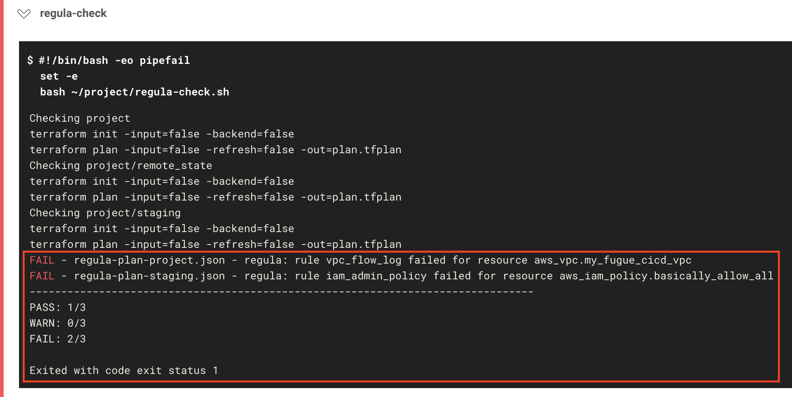
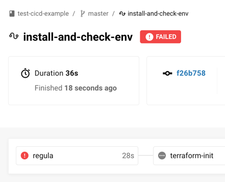
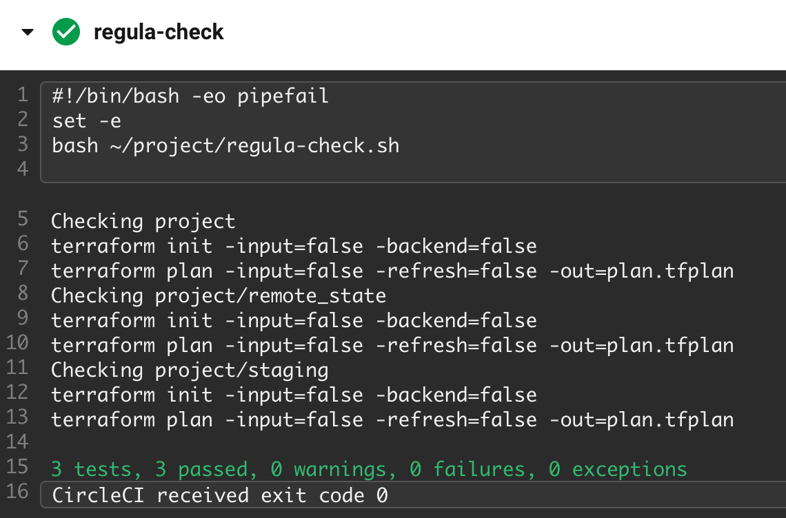
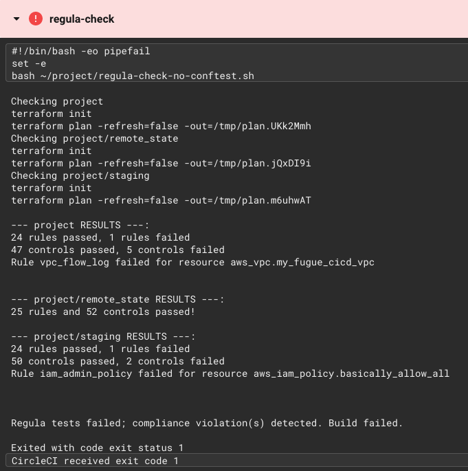

# CI/CD with Fugue, Terraform, GitHub, CircleCI: Part 2

 

- [Getting Started](#getting-started)
- [Steps](#steps)
	- [Step 1: Download example repo ZIP](#step-1-download-example-repo-zip)
	- [Step 2: Copy files into your repo](#step-2-copy-files-into-your-repo)
	- [Step 3: Uncomment `terraform apply` step](#step-3-uncomment-terraform-apply-step)
	- [Step 3a: Understand the pipeline](#step-3a-understand-the-pipeline)
		- [.circleci/config.yml](#circleciconfigyml)
		- [regula-check.sh](#regula-checksh)
		- [main.tf (root)](#maintf-root)
		- [main.tf (staging)](#maintf-staging)
		- [What's the deal with the backend?](#whats-the-deal-with-the-backend)
	- [Step 4: Commit and push changes](#step-4-commit-and-push-changes)
	- [Step 5: Watch the CI/CD magic!](#step-5-watch-the-cicd-magic)
	- [Step 6 (optional): Bring Terraform into compliance](#step-6-optional-bring-terraform-into-compliance)
- [What's Next?](#whats-next)
- [Alternate Configuration Without Conftest](#alternate-configuration-without-conftest)

In [part 1 of this walkthrough](https://github.com/fugue/example-tf-circleci), we set up a CI/CD pipeline to define, commit, deploy, and secure infrastructure as code. To recap, here are the components:

- [Amazon Web Services](https://aws.amazon.com/) (AWS): Provide cloud infrastructure (a VPC and security group)
- [Terraform](https://www.terraform.io/): Define infrastructure as code
- [GitHub](https://github.com/): Store infrastructure as code in version control
- [CircleCI](https://circleci.com/): Deploy infrastructure via Terraform and kick off Fugue scan
- [Fugue](https://riskmanager.fugue.co/register): Scan infrastructure for any noncompliant resources and set a new baseline 

Here, in part 2, we'll add a new component to the front of the pipeline:

- [Regula](https://github.com/fugue/regula): Evaluate Terraform infrastructure-as-code for compliance

Our open source tool [Regula](https://github.com/fugue/regula) uses the [Open Policy Agent](https://www.openpolicyagent.org/) (OPA) engine to check Terraform plans against a library of compliance policies. The policy-as-code is written in [Rego](https://www.openpolicyagent.org/docs/latest/policy-language/), OPA's query language.

With the addition of Regula, the pipeline demonstrates end-to-end security and compliance. Regula validates resource configuration pre-deployment and Fugue ensures it stays compliant post-deployment.

We'll also implement an open source utility called [Conftest](https://github.com/instrumenta/conftest/), which is a test runner for configuration files that use Rego for policy-as-code. Regula integrates seamlessly with Conftest, so we'll get the advantages of both:

- Easy CI integration and policy retrieval from Conftest
- Terraform plan parsing and the rule set from Regula

(For a version of this example that does not use Conftest, see [Alternate Configuration Without Conftest](#alternate-configuration-without-conftest).)

## Getting Started

**Part 1 is a prerequisite**, since this walkthrough assumes you've completed it. (If you haven't yet, [visit the repo](https://github.com/fugue/example-tf-circleci)!)

Once you've done that, you're golden. There aren't any additional prerequisites for this walkthrough.

## Steps

Here's what we'll do today:

1. [Download ZIP of GitHub repo](#step-1-download-example-repo-zip)
2. [Copy files into your repo from part 1](#step-2-copy-files-into-your-repo)
3. [Uncomment `terraform apply` step](#step-3-uncomment-terraform-apply-step)
4. [Commit and push changes](#step-4-commit-and-push-changes)
5. [Watch the CI/CD magic!](#step-5-watch-the-cicd-magic)

And, there's an optional step:

6. [Bring Terraform into compliance to pass Regula check](#step-6-optional-bring-terraform-into-compliance)

If you'd like a sneak peek at the new files and what they do, jump ahead to [step 3a](#step-3a-understand-the-pipeline).

### Step 1: Download example repo ZIP

Once again, we've conveniently created a GitHub repo (this one!) with all the code you need. [Download the ZIP here.](https://github.com/fugue/example-tf-circleci-part-2/archive/master.zip)

### Step 2: Copy files into your repo

Unzip the archive and copy the following files into the root of the repo you set up in part 1:

```bash
cp -R .circleci main.tf regula-check.sh staging ../path-to-your-repo
```

We'll go over what each file does shortly in [step 3a](#step-3a-understand-the-pipeline).

### Step 3: Uncomment `terraform apply` step

**Action recommended (but not required)!** We've commented out the `terraform apply` step in `.circleci/config.yml` again just to be on the safe side, because this example *will deploy infrastructure* into your account (a VPC, security group, and if you follow step 6 later, the resources listed [here](#maintf-root)). Feel free to comment it back in when you're comfortable doing so -- it's [line 97](https://github.com/fugue/example-tf-circleci-part-2/blob/master/.circleci/config.yml#L97) this time. (If you're using the no-Conftest [alternate configuration](#alternate-configuration-without-conftest), it's [line 91](https://github.com/fugue/example-tf-circleci-part-2/blob/master/.circleci/config-no-conftest.backup#L91).)

If you'd rather, however, you can keep the line commented out -- it's not strictly necessary for the walkthrough, since we're focusing on the Regula part of the pipeline. Just note that you'll really get the full effect of the pipeline when CircleCI deploys your updated infrastructure and Fugue scans it in context with other resources in the environment.

### Step 3a: Understand the pipeline

Before we go further, let's take a look at the new and updated files.

#### [.circleci/config.yml](https://github.com/fugue/example-tf-circleci-part-2/blob/master/.circleci/config.yml)

Our CircleCI workflow has a new job, `regula`. The job does a few different things:

- [Checks out the repo](https://github.com/fugue/example-tf-circleci-part-2/blob/master/.circleci/config.yml#L27)
- Installs several binaries:
   - [Terraform](https://github.com/fugue/example-tf-circleci-part-2/blob/master/.circleci/config.yml#L14-L21)
   - [OPA](https://github.com/fugue/example-tf-circleci-part-2/blob/master/.circleci/config.yml#L29-L35)
   - [Conftest](https://github.com/fugue/example-tf-circleci-part-2/blob/master/.circleci/config.yml#L36-L42)
- [Pulls the Regula lib, rules, and Conftest integration into Conftest](https://github.com/fugue/example-tf-circleci-part-2/blob/master/.circleci/config.yml#L43-L48)
- [Runs the Conftest/Regula script](https://github.com/fugue/example-tf-circleci-part-2/blob/master/.circleci/config.yml#L49-L53)
- [Persists the files to the next job](https://github.com/fugue/example-tf-circleci-part-2/blob/master/.circleci/config.yml#L54-L57)

Here's where the cool stuff happens. The Conftest/Regula script uses Conftest with Regula's integration to check all of the Terraform projects in directories specified in [`regula-check.sh`](#regula-checksh), evaluating each one for compliance with Regula's [library of rules](https://github.com/fugue/regula#rule-library).

Then, one of the following things happens:

- If the Terraform configuration files pass the compliance rules in Regula's library, the build continues to the next step, ultimately allowing Terraform to deploy the infrastructure, and Fugue to scan your environment and set a baseline.
- If Regula finds any compliance violations, the build fails. No Terraform is deployed, and Fugue does not scan the environment or update the baseline.

Because we use [Conftest](https://github.com/instrumenta/conftest/) to run the tests against Regula's library, we can validate multiple files at once, and we end up with some nicely formatted output. (You can see for yourself in [step 5](#step-5-watch-the-cicd-magic)!)

We've also modified the [`workflows`](https://github.com/fugue/example-tf-circleci-part-2/blob/master/.circleci/config.yml#L115) section of `config.yml`. This time, [`regula`](https://github.com/fugue/example-tf-circleci-part-2/blob/master/.circleci/config.yml#L119) is the first step, and the next step, [`terraform-init`](https://github.com/fugue/example-tf-circleci-part-2/blob/master/.circleci/config.yml#L120-L125), only happens if `regula` passes.

Another change is that the `regula` job happens on _every_ pushed commit. The rest of the pipeline, from deployment to scan, only happens on commits to `master`. The reason we've configured CircleCI to run Regula on every commit is in order to provide earlier notice in case someone has pushed noncompliant Terraform. This way, you'll get the benefit of Regula's pre-deployment checks and be alerted to compliance violations long before merging PRs into `master` and triggering deployment.

#### [regula-check.sh](https://github.com/fugue/example-tf-circleci-part-2/blob/master/regula-check.sh)

We've added a script, [`regula-check.sh`](https://github.com/fugue/example-tf-circleci-part-2/blob/master/regula-check.sh). The script carries out several tasks:

- [Specifies the Terraform projects to run Regula against](https://github.com/fugue/example-tf-circleci-part-2/blob/master/regula-check.sh#L3-L8)
- [Defines a function to run `terraform` commands silently, for cleaner output](https://github.com/fugue/example-tf-circleci-part-2/blob/master/regula-check.sh#L10-L22)
- [Temporarily renames the `backend.tf` file](https://github.com/fugue/example-tf-circleci-part-2/blob/master/regula-check.sh#L29-L30) (see [note](#whats-the-deal-with-the-backend))
- [Generates a JSON plan for each Terraform project](https://github.com/fugue/example-tf-circleci-part-2/blob/master/regula-check.sh#L35-L38)
- [Returns the backend file to its original name](https://github.com/fugue/example-tf-circleci-part-2/blob/master/regula-check.sh#L40-L41)
- [Runs Conftest, which uses Regula to check all JSON plans](https://github.com/fugue/example-tf-circleci-part-2/blob/master/regula-check.sh#L45-L47)

#### [main.tf (root)](https://github.com/fugue/example-tf-circleci-part-2/blob/master/main.tf)

The [`main.tf`](https://github.com/fugue/example-tf-circleci-part-2/blob/master/main.tf) file in the root of the repo still defines a [VPC and security group](https://github.com/fugue/example-tf-circleci-part-2/blob/master/main.tf#L5-L22), but it also defines a [VPC flow log](https://github.com/fugue/example-tf-circleci-part-2/blob/master/main.tf#L24-L29), which is currently commented out. Without a VPC flow log, the Terraform file violates the [Center for Internet Security AWS Foundations Benchmark](https://d0.awsstatic.com/whitepapers/compliance/AWS_CIS_Foundations_Benchmark.pdf) (CIS AWS). CIS AWS 2-9 recommends that you "Ensure VPC flow logging is enabled in all VPCs."

You can view the Rego policy for this rule [in the Regula repo](https://github.com/fugue/regula/blob/master/rules/aws/vpc_flow_log.rego).

The file defines some other resources to support the flow log:

- [A CloudWatch log group](https://github.com/fugue/example-tf-circleci-part-2/blob/master/main.tf#L31-L33)
- [An IAM role for publishing flow logs to CloudWatch Logs](https://github.com/fugue/example-tf-circleci-part-2/blob/master/main.tf#L35-L53) (see [AWS docs](https://docs.aws.amazon.com/vpc/latest/userguide/flow-logs-cwl.html#flow-logs-iam))
- [An IAM policy for the role](https://github.com/fugue/example-tf-circleci-part-2/blob/master/main.tf#L55-L77)

#### [main.tf (staging)](https://github.com/fugue/example-tf-circleci-part-2/blob/master/staging/main.tf)

The `staging` folder contains another [`main.tf`](https://github.com/fugue/example-tf-circleci-part-2/blob/master/staging/main.tf), which defines two IAM policies. [One of them](https://github.com/fugue/example-tf-circleci-part-2/blob/master/staging/main.tf#L6-L23) violates CIS AWS 1-22, "Ensure IAM policies that allow full `"*:*"` administrative privileges are not created."

View the Rego policy for CIS AWS 1-22 [in the Regula repo](https://github.com/fugue/regula/blob/master/rules/aws/iam_admin_policy.rego).

#### What's the deal with the backend?

Due to a [Terraform bug](https://github.com/hashicorp/terraform/issues/21989), it's impossible to output a Terraform plan in JSON without first running `terraform init`. And when `terraform init` is executed, Terraform detects `backend.tf` and determines that it requires backend reinitialization. This is not ideal here because it involves setting up the backend configuration again, copying existing state, and so on. We only need to generate a plan for Regula, so unsetting and resetting the S3 backend is unnecessary and undesirable.

For this reason, we rename `backend.tf` to `backend.tf.backup` in the directories we run Regula in, and when we're done, we return it to the original name. This allows us to simply generate a plan and validate it without affecting the backend.

### Step 4: Commit and push changes

Now, it's time to stage, commit, and push the changes:

```bash
git add .circleci main.tf regula-check.sh staging
git commit -m "Add files for example part 2"
git push
```

This push triggers the CI/CD pipeline, and it doesn't matter what branch you make the commit to -- the Regula step happens whenever a commit is pushed. This is in contrast to the rest of the pipeline, which *only* occurs on commits to `master` -- say, after you've merged a PR from a hotfix branch.

We've arranged it this way to maximize the benefit from Regula's pre-deployment checks.

### Step 5: Watch the CI/CD magic!

Assuming you've kept the same repo and CircleCI configuration as in [part 1](https://github.com/fugue/example-tf-circleci), navigate to your CircleCI dashboard to see what's happening.

CircleCI should be running the `regula` job:


Whoops! Looks like our Terraform failed the Regula check:



If you view the job results, you'll see the following error message:


```bash
FAIL - regula-plan-project.json - regula: rule vpc_flow_log failed for resource aws_vpc.my_fugue_cicd_vpc
FAIL - regula-plan-staging.json - regula: rule iam_admin_policy failed for resource aws_iam_policy.basically_allow_all
--------------------------------------------------------------------------------
PASS: 1/3
WARN: 0/3
FAIL: 2/3

Exited with code exit status 1
```

Because `main.tf` and `staging/main.tf` defined noncompliant resources, they failed the Regula check, and therefore the workflow as a whole failed.

Let's reflect on this for a second, because it's worth emphasizing: Regula's pre-deployment check just saved us from provisioning noncompliant infrastructure!

### Step 6 (optional): Bring Terraform into compliance

Now that you've seen what happens when Regula flags a noncompliant resource, you have the option to see what happens when all resources are compliant.

**Action required!** You'll need to make a couple of edits:

- In `main.tf` (root), *uncomment* [lines 24-77](https://github.com/fugue/example-tf-circleci-part-2/blob/master/main.tf#L24-L77) to add the VPC flow log and associated resources.
- In `staging/main.tf`, comment *out* [lines 6-23](https://github.com/fugue/example-tf-circleci-part-2/blob/master/staging/main.tf#L6-L23) to remove the "allow all" IAM policy.

Once that's done, go ahead and stage, commit, and push the changes:

```bash
git add main.tf staging/main.tf
git commit -m "Bring resources into compliance"
git push
```

Head to the CircleCI dashboard, and you'll see that the Regula check passes this time:


When you view the job results, you'll see the following message:



```bash
PASS: 3/3
WARN: 0/3
FAIL: 0/3

CircleCI received exit code 0
```

Congratulations! Once again, Regula has checked your infrastructure-as-code, and this time the resources have passed the library of rules.

The build goes on to the next job, `terraform-init`, and will continue to the `hold-for-approval` step. At this point, you can manually approve the deployment and allow Terraform to apply it. Then, Fugue kicks off a scan to validate the new and existing infrastructure, and sets a baseline to facilitate drift detection.

Even though Regula is able to catch compliance violations before they happen, Fugue provides an extra layer of protection by checking for compliance violations *in context* of existing infrastructure.

## What's Next?

If you missed it the first time, check out [example-tf-circleci](https://github.com/fugue/example-tf-circleci), which has the code for part 1.

We'll continue to add more rules to [Regula](https://github.com/fugue/regula), so bookmark the repo and keep checking back!

Don't forget -- if you'd like to sign up for a free Enterprise trial, or a free-forever
Developer account, [register here](https://riskmanager.fugue.co/register).

Finally, for more about Fugue, see the [Fugue docs](https://docs.fugue.co) and [fugue.co](https://www.fugue.co).

## Alternate Configuration Without Conftest

If you'd prefer to use a CircleCI configuration that does not involve Conftest, rename both configurations in the .circleci folder and commit the changes:

```
git mv .circleci/config.yml .circleci/config-with-conftest.backup
git mv .circleci/config-no-conftest.backup .circleci/config.yml
git commit -m "Switch to non-Conftest version of CircleCI config"
```

This renames the configuration files so CircleCI uses the no-Conftest version whenever a commit is pushed to `master`, and ignores the Conftest version.

The no-Conftest version uses the script [regula-check-no-conftest.sh](https://github.com/fugue/example-tf-circleci-part-2/blob/master/regula-check-no-conftest.sh). Instead of using Conftest to pull in the Regula library and then check the Terraform, the script uses only Regula to check the Terraform. The script also parses the results with [jq](https://stedolan.github.io/jq/) to get Conftest-like human-readable output.

The output looks slightly different but the effect is the same -- you'll still see a failed build if there are compliance violations in your Terraform, and if there aren't, your build succeeds.

Here's an example of how the CircleCI build looks when Regula detects compliance violations:



And here's how it looks when no violations are detected:

